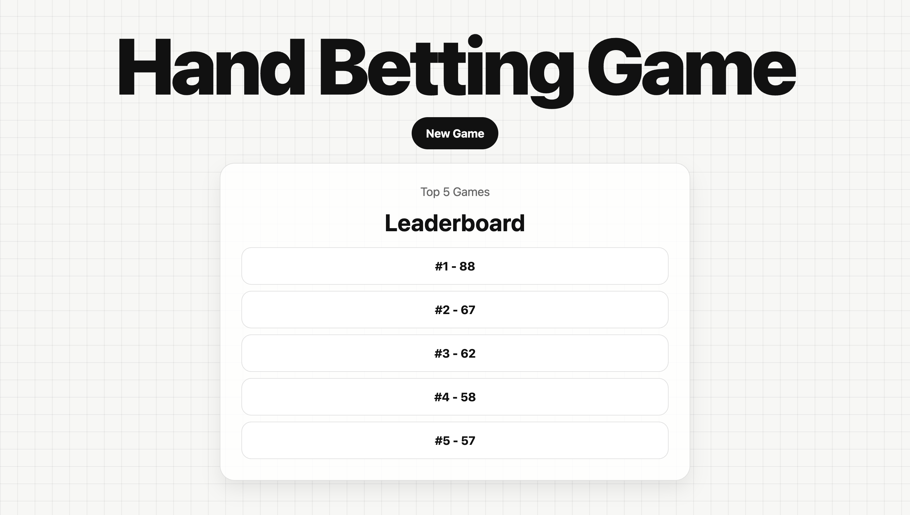
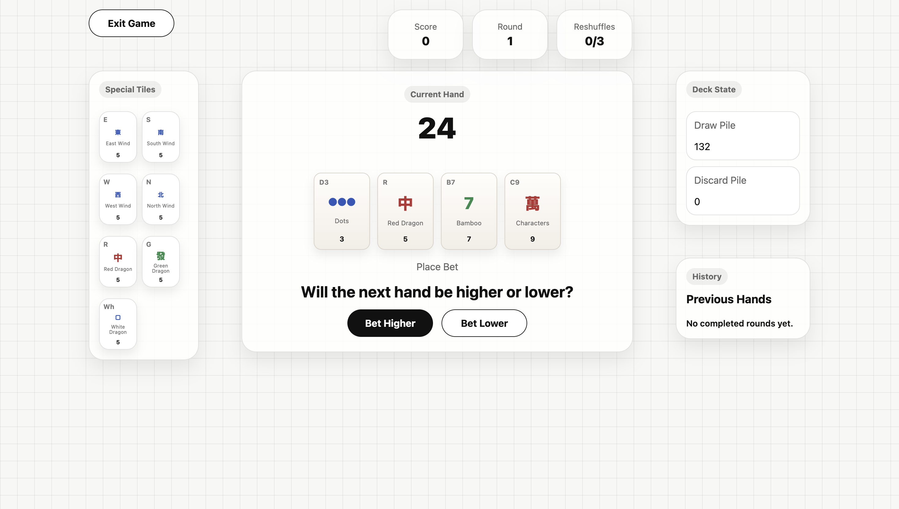
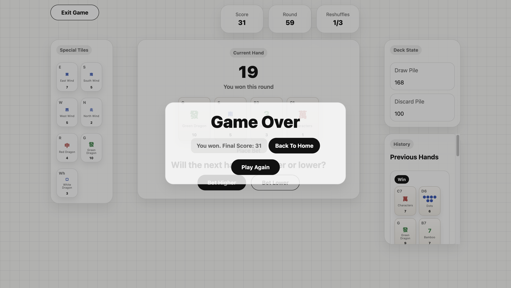

# Mahjong Hand Betting Game

## Date: 5/4/2026

### By: Bidoor Almannaei

#### [GitHub](https://github.com/Bodoorr) | [LinkedIn](https://www.linkedin.com/in/budoor-almannaei/)

---

### **_Description_**

####

Mahjong Hand Betting Game is a browser game based on a simplified Mahjong tile system. The player starts with a hand of 4 tiles and must bet whether the next hand will be higher or lower than the current one. Wind and dragon tiles have dynamic values that change depending on whether the player wins or loses the round, which makes the game more strategic over time.

The game ends when any special tile reaches `0` or `10`, or when the reshuffle limit is reached.

---

### **_Live Version_**

#### [Play the game here]()

---

### **_Technologies Used_**

- HTML
- CSS
- JavaScript

---

### **_Special Features_**

1. Home page with New Game entry
2. Top 5 leaderboard using LocalStorage
3. Higher or lower betting system
4. Dynamic wind and dragon tile values
5. Draw pile and discard pile tracking
6. Reshuffle system with game over condition
7. Previous hands history
8. End game popup with final result and score
9. Responsive layout for desktop and smaller screens

---

### **_Setup Instructions_**

1. Clone this repository
2. Open the project folder
3. Run the project with a local server such as Live Server in VS Code
4. Open `index.html` in the browser through the local server

---

### **_Game Rules_**

- The game uses Mahjong-inspired tiles:
  - Bamboo tiles from 1 to 9
  - Character tiles from 1 to 9
  - Dot tiles from 1 to 9
  - Wind tiles: East, South, West, North
  - Dragon tiles: Red, Green, White

- Each round:
  - The player sees the current hand total
  - The player chooses `Higher` or `Lower`
  - A new hand is drawn
  - If the bet is correct, the player wins the round and the score increases

- Special tiles:
  - Wind and dragon tiles start with value `5`
  - If the player wins a round, the value of any special tile in the current hand increases by `1`
  - If the player loses a round, the value of any special tile in the current hand decreases by `1`

- The game ends when:
  - Any special tile reaches `0`
  - Any special tile reaches `10`
  - The reshuffle limit reaches `3`

---

### **_AI Usage_**

AI was used as a support tool during development for:

- brainstorming layout and UI ideas
- refining CSS styling and responsiveness
- helping structure some repetitive tile display data
- reviewing wording for comments and documentation

The game logic, state management, reshuffle flow, betting rules, leaderboard behavior, testing, debugging, and final adjustments were implemented and reviewed manually.

---

### **_Screenshots_**

#### Home page

#### Game page

#### End game

---

### **_Future Updates_**

- [ ] Add sound effects
- [ ] Add more visual tile styles
- [ ] Add difficulty variations
- [ ] Add round statistics
- [ ] Add game rules page

---

### **_Credits_**

##### ChatGPT: [chat.openai.com](https://chat.openai.com)

##### W3schools: [W3schools](https://www.w3schools.com)

---
